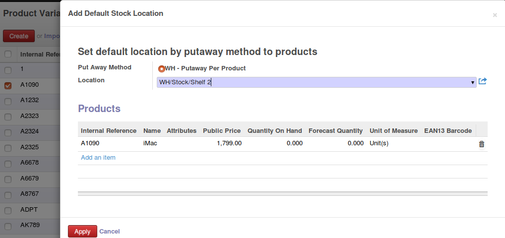

.. image:: https://img.shields.io/badge/licence-AGPL--3-blue.svg
   :target: http://www.gnu.org/licenses/agpl-3.0-standalone.html
   :alt: License: AGPL-3

Putaway strategy per product
============================

This module extends the functionality of the odoo putaway strategy.
It defines a new type of putaway strategy where users can set a specific
stock location per product.

On the product form, the case, rack, location fields are replaced with a
specific putaway strategy and location id for the product.

A putaway strategy can be used to ensure that incoming products will be
stored in the location set on the product form.

A recommended set-up is to create a separate putaway strategy for each
warehouse. This will ensure that the same product will be placed in the
appropriate location in each warehouse it is received.

Installation
------------

To install this module, just click the install button.

Configuration
-------------

To configure this module, you need to:

#. Go to Settings -> Configuration -> Warehouse
#. Enable "Manage multiple locations and warehouses'
#. Enable "Manage advanced routes for your warehouse"
#. Go to Warehouse -> Configuration -> Locations
#. On the main inventory location of your warehouse,
   set a new putaway strategy.
#. For the new putaway strategy, select 'Fixed per product location'
   as method

Usage
-----

=====

To use this module, you need to:

#. Select the proper stock locations for each product on the product form
   on the "Inventory" tab
#. If your products share some locations, you can use a wizard to make
   encoding easier

|

.. image:: stock_product_putaway/static/description/default_loc.png
   :alt: Set default location by putaway method to products

|

.. image:: https://odoo-community.org/website/image/ir.attachment/5784_f2813bd/datas
   :alt: Try me on Runbot
   :target: https://runbot.odoo-community.org/runbot/153/8.0

Known issues / Roadmap
----------------------

Bug Tracker
-----------

Bugs are tracked on `GitHub Issues
<https://github.com/OCA/stock-logistics-warehouse/issues>`_. In
case of trouble, please
check there if your issue has already been reported. If you spotted it first,
help us smashing it by providing a detailed and welcomed `feedback
<https://github.com/OCA/stock-logistics-warehouse/issues/new?body=module:%20stock_putaway_product%0Aversion:%208.0%0A%0A**Steps%20to%20reproduce**%0A-%20...%0A%0A**Current%20behavior**%0A%0A**Expected%20behavior**>`_.

Images

* Odoo Community Association: `Icon <https://github.com/OCA/maintainer-tools/blob/master/template/module/static/description/icon.svg>`_.

Credits
-------

### Contributors

* Jos De Graeve - Apertoso N.V. <Jos.DeGraeve@apertoso.be>

### Funders

### Maintainer

.. image:: https://odoo-community.org/logo.png
   :alt: Odoo Community Association
   :target: https://odoo-community.org

This module is maintained by the OCA.

OCA, or the Odoo Community Association, is a nonprofit organization whose
mission is to support the collaborative development of Odoo features and
promote its widespread use.

To contribute to this module, please visit https://odoo-community.org.

[//]: # (copyright)

----

**Odoo** is a trademark of [Odoo S.A.](https://www.odoo.com/) (formerly OpenERP, formerly TinyERP)

**OCA**, or the [Odoo Community Association](http://odoo-community.org/), is a nonprofit organization whose
mission is to support the collaborative development of Odoo features and
promote its widespread use.

**zeroincombenze®** is a trademark of [SHS-AV s.r.l.](http://www.shs-av.com/)
which distributes and promotes **Odoo** ready-to-use on its own cloud infrastructure.
[Zeroincombenze® distribution](http://wiki.zeroincombenze.org/en/Odoo)
is mainly designed for Italian law and markeplace.
Everytime, every Odoo DB and customized code can be deployed on local server too.

[//]: # (end copyright)

[//]: # (addons)

[//]: # (end addons)

